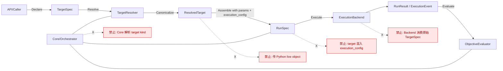

# ADR 0002: 冻结 TargetResolver 架构边界与术语

## 状态

已采纳（迭代 1）

## 背景

ADR 0001 已引入 `TargetSpec`，并要求在 `ExperimentSpec` 中显式声明 target。  
进入本迭代后，需要进一步冻结“声明 target”与“执行 target”的抽象边界，避免后续实现把 target 逻辑重新耦合回 core 或 execution 配置。

本 ADR 只冻结术语、边界与数据流，不涉及功能代码改造。

## 决策

### 1) 五个核心概念（统一术语）

1. **TargetSpec**
   - 用户在 experiment 级声明的 target 规格。
   - 仅表达“我要跑什么目标”，不包含运行期 live 对象。
   - 必须可序列化、可哈希、可持久化。

2. **TargetResolver**
   - 负责把 `TargetSpec` 解释/解析为 `ResolvedTarget` 的组件（端口或适配器）。
   - 是唯一允许理解 target kind/target schema 的边界。

3. **ResolvedTarget**
   - 由 `TargetResolver` 产出的、可直接用于运行组装的 canonical 目标描述。
   - 仍然是纯数据对象，不携带 Python live object。

4. **RunSpec**
   - trial 级运行规格，由“`ResolvedTarget` + 本次 trial 参数 + execution 静态配置”组装得到。
   - 是执行面的直接输入载体。

5. **ExecutionBackend**
   - 只消费 `RunSpec` 并执行，产出执行事件/结果。
   - 不参与 target 解释，不消费用户原始 `TargetSpec`。

### 2) 职责分层（声明/解释/组装/执行/评估）

| 分层动作 | 责任主体 | 输入 | 输出 |
|---|---|---|---|
| 声明（Declare） | API 调用方 / ExperimentSpec | 用户配置 | `TargetSpec` |
| 解释（Resolve） | `TargetResolver` | `TargetSpec` | `ResolvedTarget` |
| 组装（Assemble） | `RunSpecBuilder`（由 orchestrator 调用） | `ResolvedTarget` + `params` + `execution_config` | `RunSpec` |
| 执行（Execute） | `ExecutionBackend` | `RunSpec` | `ExecutionEvent` / `RunResult` |
| 评估（Evaluate） | `ObjectiveEvaluator`（可含 `ProgressScorer` 中间评估） | `RunResult` / `Checkpoint` | `ObjectiveResult` / pruning 中间值 |

### 3) 明确禁止事项（硬约束）

- **core 不解析 target kind**（core 只编排，不做 target 语义解释）。
- **ExecutionBackend 不消费用户原始 `TargetSpec`**（只接收 `RunSpec`）。
- **不把 target 塞进 `execution_config`**（target 与 execution 配置必须解耦）。
- **不传 Python live object**（边界对象必须是可序列化数据，不允许传进程内对象句柄）。

### 4) 生命周期冻结

- `TargetSpec`：**experiment 级固定**（同一 experiment 不随 trial 变化）。
- `ResolvedTarget`：**experiment 级固定**（对同一 experiment 只解析一次并复用）。
- `params`：**trial 级变化**（每个 trial 采样不同参数）。

### 5) Fail-fast 原则（显式）

以下情况必须**立即失败**，不得 fallback、不得猜测：

1. 缺失 `TargetSpec`。
2. `TargetSpec` 无法被 `TargetResolver` 解析（未知 kind、schema 不合法、依赖缺失等）。
3. 组装 `RunSpec` 时缺失 `ResolvedTarget`。

禁止从 `execution_config` 或 `objective_config` 反向推断 target。

## 职责边界图

## 数据流图

## 影响与后续实现约束

- 后续实现中，`TargetResolver` 作为唯一 target 解释入口；任何绕过该入口的实现均视为违反 ADR。
- `RunSpecBuilder` 的输入语义应以 `ResolvedTarget` 为准，而非用户原始 `TargetSpec`。
- 执行链路对 target 的消费必须通过 `RunSpec`，以保持可测试性与可替换性。
