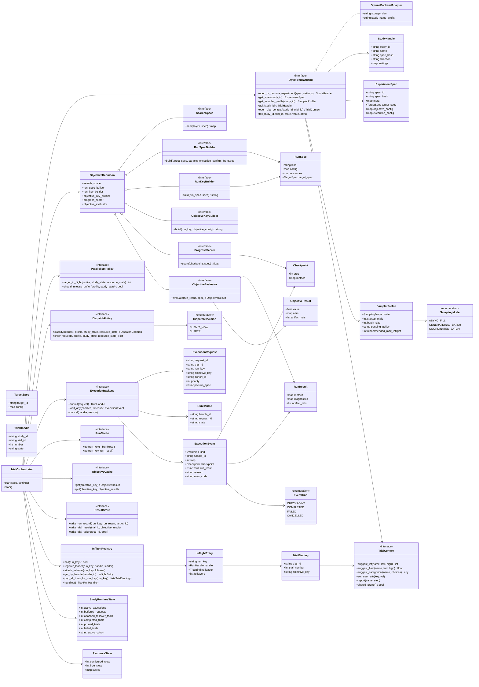
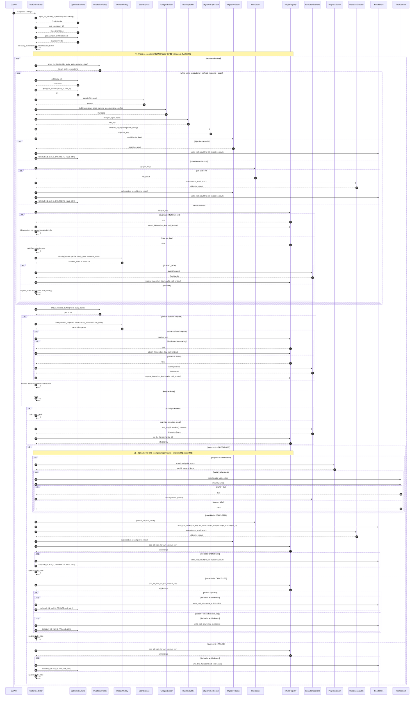

# 控制面优化框架开发文档（最终冻结版 `V1`）

## 文档状态

| 项目 | 值 |
|---|---|
| 文档版本 | `v1.0-frozen` |
| 状态 | **已冻结，可直接开发** |
| 语言 / 实现建议 | `Python 3.10+` |
| 默认优化后端 | `Optuna` |
| 当前范围 | **单目标优化控制面** |
| 是否包含 Worker 细节 | **否** |
| 是否包含运行模块内部实现 | **否，统一抽象为 `ExecutionBackend`** |

---

## 一页摘要

**本项目是一个"优化控制面框架"**，不是回测执行引擎，也不是 Optuna 的 `objective()` 封装脚本。

### 最终冻结的核心决策

- **Optuna 是默认 `OptimizerBackend` 实现，不是框架本体**
- **删除 `StudyManager` 与 `SpecRegistry`**，其职责并入 `OptimizerBackend`
- **删除胖接口 `ObjectivePlugin`**，改为组合式 `ObjectiveDefinition`
- **Loss 不在 backend 里算**
  - 中间 pruning score：`ProgressScorer`
  - 最终 objective / loss：`ObjectiveEvaluator`
  - 最终 `tell()`：仅由 `TrialOrchestrator` 负责
- **运行模块完全抽象为 `ExecutionBackend`**
- **双层缓存**
  - `RunCache`：缓存 `RunResult`
  - `ObjectiveCache`：缓存 `ObjectiveResult`
- **并发策略是 sampler-aware 的**
  - `SamplerProfile`
  - `ParallelismPolicy`
  - `DispatchPolicy`
- **`V1` 只完整实现 `ASYNC_FILL`**
  - `GENERATIONAL_BATCH` / `COORDINATED_BATCH` 保留接口，不作为 `V1` 必做功能
- **必须实现 `run_key` 级 in-flight dedup**
- **一个 `study` 同时只允许一个 `TrialOrchestrator` 实例**
- **`V1` 只支持单目标优化**
- **目标函数 / loss 变化时必须新开 study，但允许复用 `RunCache`**

---

## 设计模式

本项目采用 **Ports & Adapters（六边形架构）** 设计模式：

- **Domain**：纯领域模型，零外部依赖
- **Ports**：所有 Protocol 接口定义（驱动型端口）
- **Adapters**：所有具体实现（适配器）
- **Core**：应用核心编排逻辑，只依赖 Domain + Ports

依赖方向（严格单向）：

```
adapters/ → core/ → ports/ → domain/
```

---

# 1. 项目目标与边界

## 1.1 项目目标

构建一个可复用的优化控制面框架，负责以下事情：

- 实验打开 / 恢复
- Optuna `ask / report / prune / tell`
- 参数空间采样接线
- 运行配置构造
- 缓存复用
- 并发调度
- in-flight 去重
- pruning 接线
- 最终 objective 计算
- 结果持久化
- 停止控制
- 观测性

## 1.2 非目标

以下内容**不在 `V1` 范围内**：

- Worker / Queue / Heartbeat / Retry 内部实现
- 多 orchestrator 共同驱动一个 study
- 多目标优化
- UI、权限、租户
- 大对象 artifact 的存储实现细节
- orchestrator 进程崩溃后的 durable inflight 恢复
- 联合 batch BO 的数学实现

---

# 2. 冻结范围

## 2.1 冻结项

| 编号 | 冻结项 | 最终方案 |
|---|---|---|
| `F-01` | 优化形态 | `V1` 单目标优化 |
| `F-02` | 控制器拓扑 | 一个 `study` 一个 `TrialOrchestrator` |
| `F-03` | 运行模块 | 完全抽象为 `ExecutionBackend` |
| `F-04` | 优化后端 | 默认 `OptunaBackendAdapter` |
| `F-05` | 插件边界 | `ObjectiveDefinition` 组合式接口 |
| `F-06` | loss 计算位置 | `ProgressScorer` + `ObjectiveEvaluator` |
| `F-07` | 缓存策略 | `RunCache` + `ObjectiveCache` 双层缓存 |
| `F-08` | 去重策略 | 必须做 `run_key` 级 in-flight dedup |
| `F-09` | 并发模式 | 架构支持 3 种，`V1` 完整实现 `ASYNC_FILL` |
| `F-10` | 停止策略 | 默认优雅停止 |
| `F-11` | 重试策略 | `V1` 不在控制面实现；如需重试，由 `ExecutionBackend` 内部承担 |
| `F-12` | 产物 | 控制面只处理 `artifact_refs` |
| `F-13` | objective 变更 | 必须新开 study，但可复用 `RunCache` |
| `F-14` | backend 交互 | 仅 `TrialOrchestrator` 可调用 `report / should_prune / tell` |
| `F-15` | target 解释边界 | 冻结为 `TargetSpec -> TargetResolver -> ResolvedTarget -> RunSpec -> ExecutionBackend`（见 ADR 0002） |

## 2.2 `V1` 支持的 sampler

| Sampler | 是否支持 | 模式 |
|---|---|---|
| `RandomSampler` | 是 | `ASYNC_FILL` |
| `TPESampler` | 是 | `ASYNC_FILL` |
| `NSGAIISampler` | 否（接口预留） | 未来 `GENERATIONAL_BATCH` |
| `NSGAIIISampler` | 否（接口预留） | 未来 `GENERATIONAL_BATCH` |
| `CmaEsSampler` | 否（接口预留） | 未来 `GENERATIONAL_BATCH` / 小并发异步 |

## 2.3 边界冻结补充（TargetResolver）

本项目在迭代 1 冻结 target 解释边界，详见：`docs/adr/0002-target-resolver-architecture.md`。

关键约束（摘要）：

- `TargetSpec` 与 `ResolvedTarget` 均为 experiment 级固定对象。
- `params` 为 trial 级变量，不改变 target 身份。
- core 不解析 target kind；执行后端不消费原始 `TargetSpec`。
- 缺失 target 或不可解析时必须 fail-fast，禁止 fallback 或反向猜测。

---

# 3. 架构总览

系统分 5 层：

1. **Orchestration 层**
   - `TrialOrchestrator`
   - 控制主循环与状态机

2. **Optimization Backend 层**
   - `OptimizerBackend`
   - `OptunaBackendAdapter`
   - `TrialContext`

3. **Objective Definition 层**
   - `SearchSpace`
   - `RunSpecBuilder`
   - `RunKeyBuilder`
   - `ObjectiveKeyBuilder`
   - `ProgressScorer`
   - `ObjectiveEvaluator`

4. **Execution 抽象层**
   - `ExecutionBackend`
   - `ExecutionRequest`
   - `RunHandle`
   - `ExecutionEvent`

5. **Storage / Policy 层**
   - `RunCache`
   - `ObjectiveCache`
   - `ResultStore`
   - `SamplerProfile`
   - `ParallelismPolicy`
   - `DispatchPolicy`
   - `InflightRegistry`

---

# 4. 最终类图



---

# 5. 最终时序图

> 注：图中保留了 `BUFFER` 分支以体现扩展点，但 **`V1` 对支持的 sampler 实际走 `ASYNC_FILL` 路径**，即默认 `SUBMIT_NOW`。



---

# 6. 核心流程说明

下面是与图完全一致的、可直接指导开发的主流程。

## 6.1 启动阶段

1. 外部通过 `CLI/API` 调用 `TrialOrchestrator.start(spec, settings)`。
2. `TrialOrchestrator` 调 `OptimizerBackend.open_or_resume_experiment(spec, settings)`。
3. backend 创建或恢复 study，并返回 `StudyHandle`。
4. `TrialOrchestrator` 再调用：
   - `get_spec(study_id)` 获取 canonical `ExperimentSpec`
   - `get_sampler_profile(study_id)` 获取 `SamplerProfile`
5. 初始化运行时状态：
   - `StudyRuntimeState`
   - `ResourceState`
   - `InflightRegistry`
   - `request_buffer`

## 6.2 主循环阶段

每轮循环中：

1. `ParallelismPolicy.target_in_flight()` 计算当前目标并发数。
2. orchestrator 不断 `ask()` 新 trial，直到目标并发被填满。
3. 每个 trial 都执行：
   - `open_trial_context()`
   - `SearchSpace.sample()`
   - `RunSpecBuilder.build(spec.target_spec, params, spec.execution_config)`
   - `RunKeyBuilder.build()`
   - `ObjectiveKeyBuilder.build()`

## 6.3 缓存复用顺序

严格顺序如下：

1. 先查 `ObjectiveCache`
   - 命中则直接 `write_trial_result + tell(COMPLETE)`
2. 否则查 `RunCache`
   - 命中则 `ObjectiveEvaluator.evaluate()` 后 `put ObjectiveCache + write_trial_result + tell(COMPLETE)`
3. 两层都 miss 时，才进入执行阶段

## 6.4 in-flight dedup

如果 `run_key` 已经在执行中：

- 不再重复 `submit()`
- 当前 trial 作为 follower 挂到已有 leader 上
- follower **不占执行槽位**
- `V1` 中 follower **不接收 checkpoint / pruning**
- follower 最终继承 leader 的终态

继承规则：

- leader `COMPLETED`，followers 全部 `COMPLETED`
- leader `PRUNED`，followers 全部 `PRUNED`
- leader `FAILED/CANCELLED`，followers 全部 `FAIL`

## 6.5 提交执行

若 `run_key` 不在 inflight 中：

1. 构造 `ExecutionRequest`
2. 由 `DispatchPolicy.classify()` 决定：
   - `SUBMIT_NOW`
   - `BUFFER`

`V1` 中支持的 sampler 默认都走 `SUBMIT_NOW`。

## 6.6 接收运行事件

通过 `ExecutionBackend.wait_any()` 等待事件。

### `CHECKPOINT`
- 使用 `ProgressScorer.score()` 计算中间分数
- 若返回 `float`：
  - `TrialContext.report(value, step)`
  - `TrialContext.should_prune()`
- 若应剪枝，则 `ExecutionBackend.cancel(handle, "pruned")`

### `COMPLETED`
- `RunCache.put(run_key, run_result)`
- `ResultStore.write_run_record(run_key, run_result, target_id)`
- `ObjectiveEvaluator.evaluate(run_result, spec)`
- `ObjectiveCache.put(objective_key, objective_result)`
- 对 leader 与所有 followers：
  - `ResultStore.write_trial_result(trial_id, objective_result)`
  - `OptimizerBackend.tell(COMPLETE, value, attrs)`

### `CANCELLED`
- 若 `reason == "pruned"`：
  - 所有绑定 trials 记为 `PRUNED`
- 否则：
  - 所有绑定 trials 记为 `FAIL`

### `FAILED`
- 所有绑定 trials 记为 `FAIL`

## 6.7 停止

`V1` 默认是**优雅停止**：

- 收到 stop 信号后，不再 `ask()` 新 trial
- 已提交的 inflight leader 可以继续结束
- 所有 leader 结束后退出

---

# 7. 组件规格

## 7.1 `TrialOrchestrator`

### 职责

- 驱动控制面主循环
- 与 backend 做 `ask / report / prune / tell`
- 维护运行时状态
- 处理缓存和 dedup
- 提交执行请求
- 处理执行事件
- 停止控制

### 强约束

- **系统中只有它可以和 `OptimizerBackend` 进行 `report / should_prune / tell` 交互**
- **一个 study 同时只能有一个 orchestrator 实例**

### 公开方法

```python
class TrialOrchestrator:
    def start(self, spec, settings) -> None: ...
    def stop(self) -> None: ...
```

`start()` 是唯一的启动入口，调用后同步阻塞直到循环结束。`stop()` 可在另一线程调用以触发优雅停止。`_run_loop()`、`_plan_requests()`、`_handle_event()` 均为内部实现细节，不属于公开接口。

---

## 7.2 `OptimizerBackend`

### 职责

- 打开 / 恢复 experiment
- 返回 `ExperimentSpec`
- 返回 `SamplerProfile`
- `ask()` 新 trial
- 生成 `TrialContext`
- 接收 `tell()`

### 合并职责说明

以下职责已经并入 `OptimizerBackend`：

- 原 `StudyManager`
- 原 `SpecRegistry`

### 强约束

- 不允许开发时重新拆出新的外部 `StudyManager` / `SpecRegistry` 组件
- 内部实现可以拆分，但外部接口必须保持统一

### 接口定义

```python
class OptimizerBackend(Protocol):
    def open_or_resume_experiment(self, spec, settings) -> StudyHandle: ...
    def get_spec(self, study_id: str) -> ExperimentSpec: ...
    def get_sampler_profile(self, study_id: str) -> SamplerProfile: ...
    def ask(self, study_id: str) -> TrialHandle: ...
    def open_trial_context(self, study_id: str, trial_id: str) -> TrialContext: ...
    def tell(
        self,
        study_id: str,
        trial_id: str,
        state: str,
        value: float | None,
        attrs: dict | None,
    ) -> None: ...
```

---

## 7.3 `OptunaBackendAdapter`

### 实现要求

必须基于 Optuna 的 `ask/tell` 风格，而不是 `study.optimize(objective, n_jobs=...)`。

### 建议实现方式

- `open_or_resume_experiment()`
  - 使用 Optuna RDB storage 创建或恢复 study
  - 校验 / 持久化 `spec_hash`
  - 将 canonical `ExperimentSpec` 与 study 关联
- `ask()`
  - 调用 `study.ask()`
  - 返回 `TrialHandle`
  - 内部保留 live `Trial` 对象映射，供 `open_trial_context()` 使用
- `open_trial_context()`
  - 返回对 live Optuna `Trial` 的包装
- `tell()`
  - 调用 `study.tell()`
  - 必须处理重复 `tell()` 的幂等问题

### 幂等要求

`OptimizerBackend.tell()` 必须满足：

- 同一个 trial 的相同终态重复提交应安全
- 若重复提交且内容冲突，应记录错误并拒绝 silent overwrite

### `SamplerProfile` 映射

| Optuna Sampler | `SamplerProfile.mode` | 备注 |
|---|---|---|
| `RandomSampler` | `ASYNC_FILL` | `startup_trials = 0` |
| `TPESampler` | `ASYNC_FILL` | 需读取 `n_startup_trials`；若并发，建议 `constant_liar=True` |

---

## 7.4 `TrialContext`

### 职责

- 参数建议
- trial attr 写入
- 中间值 `report`
- `should_prune()`

### 接口定义

```python
class TrialContext(Protocol):
    def suggest_int(self, name: str, low: int, high: int) -> int: ...
    def suggest_float(self, name: str, low: float, high: float) -> float: ...
    def suggest_categorical(self, name: str, choices: list) -> object: ...
    def set_user_attr(self, key: str, val: object) -> None: ...
    def report(self, value: float, step: int) -> None: ...
    def should_prune(self) -> bool: ...
```

---

## 7.5 `ObjectiveDefinition`

`ObjectiveDefinition` 是组合容器，不是大接口。

```python
@dataclass(frozen=True)
class ObjectiveDefinition:
    search_space: SearchSpace
    run_spec_builder: RunSpecBuilder
    run_key_builder: RunKeyBuilder
    objective_key_builder: ObjectiveKeyBuilder
    progress_scorer: ProgressScorer | None
    objective_evaluator: ObjectiveEvaluator
```

### 子接口职责

#### `SearchSpace`
负责在 `TrialContext` 上声明参数空间并获得本次 trial 的参数值。

```python
class SearchSpace(Protocol):
    def sample(self, ctx: TrialContext, spec: ExperimentSpec) -> dict: ...
```

#### `RunSpecBuilder`
负责把 `target_spec + params + execution_config` 变成 `RunSpec`。

```python
class RunSpecBuilder(Protocol):
    def build(
        self,
        target_spec: TargetSpec,
        params: dict[str, object],
        execution_config: dict[str, object],
    ) -> RunSpec: ...
```

#### `RunKeyBuilder`
负责生成运行层缓存 key。

```python
class RunKeyBuilder(Protocol):
    def build(self, run_spec: RunSpec, spec: ExperimentSpec) -> str: ...
```

#### `ObjectiveKeyBuilder`
负责生成目标值缓存 key。

```python
class ObjectiveKeyBuilder(Protocol):
    def build(self, run_key: str, objective_config: dict) -> str: ...
```

#### `ProgressScorer`
负责把 checkpoint 变成 pruning 用的中间值。

```python
class ProgressScorer(Protocol):
    def score(self, checkpoint: Checkpoint, spec: ExperimentSpec) -> float | None: ...
```

#### `ObjectiveEvaluator`
负责把 `RunResult` 变成最终 `ObjectiveResult`。

```python
class ObjectiveEvaluator(Protocol):
    def evaluate(self, run_result: RunResult, spec: ExperimentSpec) -> ObjectiveResult: ...
```

### 关键约束

- loss 不允许在 backend 中计算
- `ObjectiveEvaluator` 不允许直接调用 backend
- `ProgressScorer` 不允许直接调用 backend

---

## 7.6 `ExecutionBackend`

### 职责

- 接收 `ExecutionRequest`
- 返回 `RunHandle`
- 输出 `ExecutionEvent`
- 支持取消

### 强约束

- 不直接与 `OptimizerBackend` 通信
- 不计算最终 objective
- 不直接写 `RunCache` / `ObjectiveCache`

### 接口定义

```python
class ExecutionBackend(Protocol):
    def submit(self, request: ExecutionRequest) -> RunHandle: ...
    def wait_any(self, handles: list[RunHandle], timeout: float | None = None) -> ExecutionEvent | None: ...
    def cancel(self, handle: RunHandle, reason: str) -> None: ...
```

### `V1` 事件要求

- `CHECKPOINT`
- `COMPLETED`
- `FAILED`
- `CANCELLED`

### `CHECKPOINT` 约束

- `step` 必须单调递增
- `checkpoint` 内容必须足够让 `ProgressScorer` 计算中间分数

---

## 7.7 `InflightRegistry`

### 作用

解决"缓存未写回之前的重复执行"问题。

### 规则

- 一个 `run_key` 同时最多只能对应一个 leader 执行
- 相同 `run_key` 的后续 trial 必须 attach 为 follower
- follower 不占用执行槽位

### `V1` 简化语义

- 只有 leader 接收 checkpoint / pruning
- followers 不接收中间值
- followers 继承 leader 的终态和最终结果

### 接口建议

```python
class InflightRegistry:
    def has(self, run_key: str) -> bool: ...
    def register_leader(self, run_key: str, handle: RunHandle, leader_binding: TrialBinding) -> None: ...
    def attach_follower(self, run_key: str, follower_binding: TrialBinding) -> None: ...
    def get_by_handle(self, handle_id: str) -> InflightEntry: ...
    def pop_all_trials_for_run_key(self, run_key: str) -> list[TrialBinding]: ...
    def handles(self) -> list[RunHandle]: ...
```

---

## 7.8 `RunCache` / `ObjectiveCache` / `ResultStore`

### `RunCache`
- key：`run_key`
- value：`RunResult`

### `ObjectiveCache`
- key：`objective_key`
- value：`ObjectiveResult`

### `ResultStore`
用于审计与持久化，不等价于缓存。

#### 必须支持的方法

```python
class ResultStore(Protocol):
    def write_run_record(
        self,
        run_key: str,
        run_result: RunResult,
        *,
        target_id: str,
    ) -> None: ...
    def write_trial_result(self, trial_id: str, objective_result: ObjectiveResult) -> None: ...
    def write_trial_failure(self, trial_id: str, error) -> None: ...
```

### 强约束

- 必须幂等
- 必须可追踪 `trial_id / run_key / objective_key`
- 只存 `artifact_refs`，不存大 blob

---

# 8. 数据模型与 Key 规则

## 8.1 `ExperimentSpec`

推荐字段：

```json
{
  "spec_id": "exp_20260306_001",
  "spec_hash": "sha256:...",
  "meta": {
    "dataset_version": "ds_v20260301",
    "engine_version": "engine_v1.4.2",
    "search_space_version": "space_v3",
    "objective_version": "obj_v5"
  },
  "target_spec": {
    "target_id": "target_backtest_v1",
    "config": {
      "market": "us_equity",
      "venue": "paper"
    }
  },
  "objective_config": {
    "name": "single_objective_loss",
    "version": "loss_v5",
    "direction": "minimize",
    "params": {}
  },
  "execution_config": {
    "executor_kind": "backtest",
    "default_resources": {
      "cpu": 4,
      "memory_gb": 16
    }
  }
}
```

## 8.2 `RunSpec`

```json
{
  "kind": "backtest_run",
  "target_spec": {
    "target_id": "target_backtest_v1",
    "config": {
      "market": "us_equity",
      "venue": "paper"
    }
  },
  "config": {
    "param_a": 1.23,
    "param_b": 5
  },
  "resources": {
    "cpu": 4,
    "memory_gb": 16
  }
}
```

## 8.3 `RunResult`

```json
{
  "metrics": {
    "metric_1": 0.12,
    "metric_2": 15.8
  },
  "diagnostics": {
    "runtime_sec": 412.5
  },
  "artifact_refs": [
    "s3://bucket/path/report.json"
  ]
}
```

## 8.4 `ObjectiveResult`

```json
{
  "value": 0.287,
  "attrs": {
    "objective_name": "single_objective_loss",
    "objective_version": "loss_v5",
    "run_key": "run:...",
    "objective_key": "obj:..."
  },
  "artifact_refs": [
    "s3://bucket/path/report.json"
  ]
}
```

## 8.5 Key 生成规则

### `spec_hash`
- 对 canonical `ExperimentSpec` 做稳定序列化后哈希
- 不允许掺入时间戳或随机值

### `run_key`
必须只由**影响运行输出**的内容决定，建议包含：

- 规范化后的 `RunSpec`
- 数据版本
- 引擎版本
- 其他影响运行结果的环境版本

### `objective_key`
必须由以下内容决定：

- `run_key`
- `objective_config.name`
- `objective_config.version`
- `objective_config.params`

### 强制要求

- key 生成必须是纯函数
- 使用稳定序列化
- 所有 key 算法必须单元测试覆盖

---

# 9. 并发、调度与顺序语义

## 9.1 并发语义

### `V1` 只实现 `ASYNC_FILL`

含义：

- 有空位就 `ask`
- 有需要执行的 request 就立刻 `submit`
- 谁先完成谁先 `tell`
- 不等整批 trial 一起返回

## 9.2 `ParallelismPolicy`

### 语义定义

`target_in_flight()` 返回的是**目标 active execution 数**，不是目标 trial 数。

即：

- 统计对象是 **leader 执行数**
- follower trial 不占执行槽位

### `V1` 推荐实现

- `configured_slots = settings.parallelism.max_in_flight_trials`
- `free_slots = configured_slots - active_executions`
- `target_in_flight = min(configured_slots, profile.recommended_max_inflight or configured_slots)`

### `should_release_buffer()`

- `V1` 对已支持 sampler 基本返回 `False`
- 保留接口给未来 batch 模式

## 9.3 `DispatchPolicy`

### `V1` 行为

对已支持 sampler：

- `classify()` 始终返回 `SUBMIT_NOW`
- `order()` 基本不参与实际路径

## 9.4 顺序定义

系统中必须区分以下顺序：

| 顺序类型 | 含义 |
|---|---|
| `ask` 顺序 | `OptimizerBackend.ask()` 创建 trial 的顺序 |
| `submit` 顺序 | request 提交给 `ExecutionBackend` 的顺序 |
| `complete` 顺序 | 运行实际完成顺序 |
| `tell` 顺序 | backend 最终接收结果的顺序 |

### 约束

- 不保证 `tell` 顺序与 `ask` 顺序一致
- 在 `ASYNC_FILL` 下，通常是**谁先完成谁先 tell**

---

# 10. loss、pruning 与 objective 语义

## 10.1 中间值

中间 pruning 分数在 `ProgressScorer` 中计算：

```python
partial = progress_scorer.score(checkpoint, spec)
```

如果 `partial is not None`：

1. `TrialContext.report(partial, step)`
2. `TrialContext.should_prune()`

## 10.2 最终值

最终 objective 在 `ObjectiveEvaluator` 中计算：

```python
objective_result = objective_evaluator.evaluate(run_result, spec)
```

## 10.3 强约束

- backend 不计算 loss
- `ExecutionBackend` 不计算最终 objective
- 只有 `TrialOrchestrator` 能调用 `tell()`

## 10.4 objective 变更规则

以下内容任一变化，都必须新开 study：

- objective 公式变化
- objective 权重变化
- direction 变化
- pruning metric 变化

但只要 `run_key` 不变，允许复用 `RunCache`。

---

# 11. 状态与终态处理

## 11.1 终态集合

`V1` 控制面只关心 3 类 terminal 结果：

- `COMPLETE`
- `PRUNED`
- `FAIL`

## 11.2 正常完成顺序

顺序必须固定为：

1. `RunCache.put()`
2. `ResultStore.write_run_record()`
3. `ObjectiveEvaluator.evaluate()`
4. `ObjectiveCache.put()`
5. `ResultStore.write_trial_result()`
6. `OptimizerBackend.tell(COMPLETE, ...)`

## 11.3 剪枝顺序

当运行被取消且 `reason == "pruned"`：

1. `ResultStore.write_trial_failure(trial_id, "PRUNED")`
2. `OptimizerBackend.tell(PRUNED, None, attrs)`

## 11.4 失败顺序

当 `FAILED` 或非剪枝 `CANCELLED`：

1. `ResultStore.write_trial_failure(trial_id, error)`
2. `OptimizerBackend.tell(FAIL, None, attrs)`

## 11.5 follower 终态继承

`V1` 中：

- leader `COMPLETE`，followers `COMPLETE`
- leader `PRUNED`，followers `PRUNED`
- leader `FAIL/CANCELLED`，followers `FAIL`

建议给 follower 的 `attrs` 增加：

- `shared_run = true`
- `shared_run_leader_trial_id = leader_trial_id`

---

# 12. 幂等、一致性与恢复边界

## 12.1 必须幂等的接口

- `OptimizerBackend.open_or_resume_experiment()`
- `OptimizerBackend.tell()`
- `RunCache.put()`
- `ObjectiveCache.put()`
- `ResultStore.write_run_record()`
- `ResultStore.write_trial_result()`
- `ResultStore.write_trial_failure()`

## 12.2 恢复边界

### `V1` 支持

- 重新打开已有 study
- 基于 persisted 历史继续新 trial 调度

### `V1` 不支持

- orchestrator 进程崩溃后重建 `InflightRegistry`
- 重建未完成 leader 的精确执行态

### 说明

如果未来需要"控制面进程崩溃可恢复 inflight 状态"，需要把以下内容持久化：

- `InflightRegistry`
- `request_buffer`
- `leader/follower` 映射
- handle 到 trial 的绑定关系

这属于 `V2` 设计。

---

# 13. 观测性要求

## 13.1 日志字段

每条关键日志至少包含：

- `study_id`
- `trial_id`
- `trial_number`
- `run_key`
- `objective_key`
- `request_id`
- `handle_id`
- `sampling_mode`
- `event_kind`

## 13.2 指标

最少暴露以下指标：

- `trials_asked_total`
- `trials_completed_total`
- `trials_pruned_total`
- `trials_failed_total`
- `run_cache_hit_total`
- `objective_cache_hit_total`
- `execution_submitted_total`
- `inflight_leader_executions_gauge`
- `attached_follower_trials_gauge`
- `buffered_requests_gauge`

## 13.3 诊断要求

必须能通过 `trial_id` 回溯到：

- 对应的 `run_key`
- 是否是 shared run follower
- 最终 state
- 最终 tell 的 payload

---

# 14. 目录结构（Ports & Adapters）

```text
src/
  optimization_control_plane/
    __init__.py

    domain/                          # 纯领域模型，零外部依赖
      __init__.py
      models.py                      # 所有 frozen dataclass
      enums.py                       # SamplingMode, DispatchDecision, EventKind
      state.py                       # StudyRuntimeState, ResourceState

    ports/                           # 所有 Protocol 接口定义
      __init__.py
      optimizer_backend.py           # OptimizerBackend, TrialContext
      execution_backend.py           # ExecutionBackend
      objective.py                   # SearchSpace, RunSpecBuilder, RunKeyBuilder,
                                     # ObjectiveKeyBuilder, ProgressScorer, ObjectiveEvaluator
      cache.py                       # RunCache, ObjectiveCache
      result_store.py                # ResultStore
      policies.py                    # ParallelismPolicy, DispatchPolicy

    adapters/                        # 所有具体实现
      __init__.py
      optuna/                        # Optuna 适配器
        __init__.py
        backend_adapter.py           # OptunaBackendAdapter
        trial_context.py             # OptunaTrialContext
        sampler_profile.py           # SamplerProfile 到 Optuna sampler 的映射
      execution/                     # 执行后端适配器
        __init__.py
        fake_backend.py              # FakeExecutionBackend（测试用）
      storage/                       # 存储适配器（V1 文件实现）
        __init__.py
        file_run_cache.py            # FileRunCache
        file_objective_cache.py      # FileObjectiveCache
        file_result_store.py         # FileResultStore
      policies/                      # 策略适配器
        __init__.py
        async_fill_parallelism.py    # AsyncFillParallelismPolicy
        submit_now_dispatch.py       # SubmitNowDispatchPolicy

    core/                            # 应用核心，只依赖 domain + ports
      __init__.py
      orchestration/
        __init__.py
        trial_orchestrator.py        # TrialOrchestrator
        inflight_registry.py         # InflightRegistry, TrialBinding, InflightEntry
      objective_definition.py        # ObjectiveDefinition 组合容器

tests/
  __init__.py
  unit/
    __init__.py
  integration/
    __init__.py
  e2e/
    __init__.py
```

### 依赖方向（严格单向）

```
adapters/ → core/ → ports/ → domain/
```

- `core/` 只 import `ports/` 和 `domain/`，绝不 import `adapters/`
- `adapters/` 可以 import `domain/` 和 `ports/`

---

# 15. V1 开发步骤与任务清单

## 阶段 1：领域模型与接口层

### 目标
定义所有核心数据结构和 Protocol 接口，建立类型安全的骨架。

### 交付物

| 任务编号 | 文件 | 内容 |
|---|---|---|
| `T-1.1` | `domain/enums.py` | `SamplingMode`、`DispatchDecision`、`EventKind` 枚举定义 |
| `T-1.2` | `domain/models.py` | `ExperimentSpec`、`StudyHandle`、`TrialHandle`、`RunSpec`、`Checkpoint`、`RunResult`、`ObjectiveResult`、`ExecutionRequest`、`RunHandle`、`ExecutionEvent` — 全部 `frozen=True` dataclass |
| `T-1.3` | `domain/state.py` | `StudyRuntimeState`（可变，带原子更新方法）、`ResourceState` |
| `T-1.4` | `ports/optimizer_backend.py` | `OptimizerBackend` Protocol、`TrialContext` Protocol |
| `T-1.5` | `ports/execution_backend.py` | `ExecutionBackend` Protocol |
| `T-1.6` | `ports/objective.py` | `SearchSpace`、`RunSpecBuilder`、`RunKeyBuilder`、`ObjectiveKeyBuilder`、`ProgressScorer`、`ObjectiveEvaluator` Protocol |
| `T-1.7` | `ports/cache.py` | `RunCache`、`ObjectiveCache` Protocol |
| `T-1.8` | `ports/result_store.py` | `ResultStore` Protocol |
| `T-1.9` | `ports/policies.py` | `ParallelismPolicy`、`DispatchPolicy` Protocol |
| `T-1.10` | `core/objective_definition.py` | `ObjectiveDefinition` frozen dataclass 组合容器 |
| `T-1.11` | `core/orchestration/inflight_registry.py` | `TrialBinding`、`InflightEntry` 数据类定义（实现在阶段 6） |

### 验收标准
- 所有接口可 `import`，无循环依赖
- `mypy --strict` 类型检查通过
- `spec_hash`、`run_key`、`objective_key` 生成的单元测试通过

---

## 阶段 2：实现 OptunaBackendAdapter

### 目标
实现基于 Optuna ask/tell 风格的 `OptimizerBackend` 适配器。

### 交付物

| 任务编号 | 文件 | 内容 |
|---|---|---|
| `T-2.1` | `adapters/optuna/backend_adapter.py` | `OptunaBackendAdapter` 完整实现 |
| `T-2.2` | `adapters/optuna/trial_context.py` | `OptunaTrialContext` — 对 live Optuna Trial 的包装 |
| `T-2.3` | `adapters/optuna/sampler_profile.py` | `SamplerProfile` 数据类 + `build_sampler_profile()` 工厂函数 |

### 实现要求
- `open_or_resume_experiment()`：使用 Optuna RDB storage（SQLite），校验 `spec_hash`
- `ask()`：调用 `study.ask()`，内部维护 live Trial 映射
- `open_trial_context()`：返回 `OptunaTrialContext` 包装
- `tell()`：调用 `study.tell()`，满足幂等要求
- `get_sampler_profile()`：根据 sampler 类型映射 `SamplerProfile`

### 验收标准
- 可创建 / 恢复 study
- 可 ask 一个 trial 并获得 TrialContext
- 可完成 `tell(COMPLETE/PRUNED/FAIL)`
- 重复 tell 相同终态安全、冲突终态报错

---

## 阶段 3：文件存储层实现

### 目标
基于 JSON 文件实现双层缓存和审计存储。

### 交付物

| 任务编号 | 文件 | 内容 |
|---|---|---|
| `T-3.1` | `adapters/storage/file_run_cache.py` | `FileRunCache` — 基于文件的 `RunResult` 缓存 |
| `T-3.2` | `adapters/storage/file_objective_cache.py` | `FileObjectiveCache` — 基于文件的 `ObjectiveResult` 缓存 |
| `T-3.3` | `adapters/storage/file_result_store.py` | `FileResultStore` — 基于文件的审计持久化 |

### 实现要求
- 可配置 `base_dir`，默认 `./data/`
- JSON 格式存储，key 作为文件名（需 safe encoding）
- 所有写入操作满足幂等要求
- `ResultStore` 支持按 `trial_id` 回溯

### 验收标准
- cache get/put 闭环通过
- 写入幂等：重复 put 相同值安全
- `write_trial_result` / `write_trial_failure` / `write_run_record` 均可按 key 查回

---

## 阶段 4：FakeExecutionBackend

### 目标
实现可编程的 fake 执行后端，供测试使用。

### 交付物

| 任务编号 | 文件 | 内容 |
|---|---|---|
| `T-4.1` | `adapters/execution/fake_backend.py` | `FakeExecutionBackend` 完整实现 |

### 实现要求
- `submit()`：接受 `ExecutionRequest`，返回 `RunHandle`
- `wait_any()`：可编程返回 `CHECKPOINT` / `COMPLETED` / `FAILED` / `CANCELLED` 事件
- `cancel()`：支持标记为已取消
- 支持配置每个 run 的行为序列（steps → checkpoint events → final event）

### 验收标准
- 在没有真实运行模块时控制面可跑通完整流程
- 可模拟 checkpoint 序列 + 最终完成/失败/取消

---

## 阶段 5：TrialOrchestrator 主循环

### 目标
实现控制面核心编排逻辑。

### 交付物

| 任务编号 | 文件 | 内容 |
|---|---|---|
| `T-5.1` | `core/orchestration/trial_orchestrator.py` | `TrialOrchestrator` 完整实现 |
| `T-5.2` | `adapters/policies/async_fill_parallelism.py` | `AsyncFillParallelismPolicy` V1 默认实现 |
| `T-5.3` | `adapters/policies/submit_now_dispatch.py` | `SubmitNowDispatchPolicy` V1 默认实现 |

### 实现要求
- `start()`：启动阶段逻辑（open/resume experiment、获取 profile、初始化状态），内部调用 `_run_loop()`
- `_run_loop()`：主循环（含缓存复用、in-flight dedup、提交、事件处理）
- `_plan_requests()`：请求规划（ask → sample → build → cache check → dedup → dispatch）
- `_handle_event()`：4 种事件处理（CHECKPOINT / COMPLETED / CANCELLED / FAILED）
- `stop()`：优雅停止

### 验收标准
- 单 trial 正常闭环（ask → execute → complete → tell）
- 多 trial `ASYNC_FILL` 并发闭环
- objective cache 命中不触发 execution
- run cache 命中只触发 evaluator

---

## 阶段 6：Pruning 与 In-flight Dedup

### 目标
完善 InflightRegistry、pruning 流程和 follower 终态继承。

### 交付物

| 任务编号 | 文件 | 内容 |
|---|---|---|
| `T-6.1` | `core/orchestration/inflight_registry.py` | `InflightRegistry` 完整实现 |
| `T-6.2` | `core/orchestration/trial_orchestrator.py` | 补充 pruning 逻辑（report → should_prune → cancel） |
| `T-6.3` | `core/orchestration/trial_orchestrator.py` | 补充 follower 终态继承逻辑 |

### 实现要求
- `InflightRegistry`：`has / register_leader / attach_follower / get_by_handle / pop_all_trials_for_run_key / handles`
- 相同 `run_key` 只执行一次，后续 trial 作为 follower
- follower 不占执行槽位
- checkpoint 时通过 `ProgressScorer` → `report` → `should_prune` → `cancel` 链路
- leader 终态 fan-out 到所有 followers

### 验收标准
- 相同 `run_key` 只执行一次
- follower 结果复用闭环通过
- pruning 闭环通过（checkpoint → report → prune → cancel → tell(PRUNED)）
- leader COMPLETED → followers COMPLETED
- leader PRUNED → followers PRUNED
- leader FAILED → followers FAIL

---

## 阶段 7：观测性与停止

### 目标
实现结构化日志、指标和优雅停止。

### 交付物

| 任务编号 | 文件 | 内容 |
|---|---|---|
| `T-7.1` | 跨文件 | 结构化日志（含 study_id, trial_id, run_key 等关键字段） |
| `T-7.2` | 跨文件 | 12 项 metrics 计数器（内存实现 + 日志输出） |
| `T-7.3` | `core/orchestration/trial_orchestrator.py` | graceful stop 完善 |
| `T-7.4` | 跨文件 | trial_id 回溯诊断能力 |

### 验收标准
- stop 后不再 ask 新 trial
- inflight leader 执行平滑结束后退出
- 12 项指标可观测
- 可按 trial_id 回溯完整链路

---

## 阶段 8：完整测试套件

### 目标
完成单元测试、集成测试和端到端测试。

### 单元测试

| 编号 | 测试内容 |
|---|---|
| `UT-1` | `spec_hash` 稳定性（相同输入 → 相同 hash） |
| `UT-2` | `run_key` 稳定性 |
| `UT-3` | `objective_key` 稳定性 |
| `UT-4` | `SearchSpace.sample()` 参数记录 |
| `UT-5` | `ProgressScorer.score()` 返回 `None` 的跳过语义 |
| `UT-6` | `ObjectiveEvaluator` 可替换性 |
| `UT-7` | `InflightRegistry` leader/follower 行为 |

### 集成测试

| 编号 | 测试内容 |
|---|---|
| `IT-1` | `OptunaBackendAdapter` 的 `ask/tell` 闭环 |
| `IT-2` | objective cache 命中不触发 execution |
| `IT-3` | run cache 命中只触发 evaluator |
| `IT-4` | pruning 闭环 |
| `IT-5` | graceful stop |
| `IT-6` | duplicate `run_key` attach follower |

### 端到端测试

| 编号 | 测试内容 |
|---|---|
| `E2E-1` | `RandomSampler + ASYNC_FILL` 完整流程 |
| `E2E-2` | `TPESampler + ASYNC_FILL` 完整流程 |
| `E2E-3` | leader 正常完成并 fan-out 到 followers |
| `E2E-4` | leader pruned，followers 继承 `PRUNED` |
| `E2E-5` | leader failed，followers 继承 `FAIL` |

### 最终验收标准

1. 使用 `TPESampler` 可稳定 `ask/tell`
2. `ASYNC_FILL` 并发执行稳定
3. `ObjectiveCache` 命中时不进入 execution
4. `RunCache` 命中时不进入 execution
5. 相同 `run_key` 同时只执行一次
6. checkpoint → `report` → `should_prune` → `cancel` → `tell(PRUNED)` 闭环成立
7. stop 后不再产生新 trial
8. `ResultStore` 与 backend 终态一致
9. 可以按 `trial_id` 完整回溯链路
10. 替换 `ObjectiveEvaluator` 不需要改 orchestrator 主流程

---

# 16. 测试要求与验收标准

（同阶段 8 内容）

---

# 17. 实现建议与默认参数

## 17.1 `V1` 默认运行方式

- orchestrator 使用单线程、同步事件循环即可
- 不要求 `asyncio`
- `ExecutionBackend.wait_any()` 支持 timeout 轮询即可

## 17.2 `TPESampler` 默认建议

- `n_startup_trials > 0`
- 并发场景建议 `constant_liar=True`
- 继续使用 `ASYNC_FILL`

## 17.3 `ResourceState` 默认建议

`V1` 没有外部资源探针时，可直接用配置推导：

- `configured_slots = settings.parallelism.max_in_flight_trials`
- `free_slots = configured_slots - active_executions`

---

# 18. 延期功能（`V2`）

以下功能不在本次开发交付中：

- 多目标优化
- `GENERATIONAL_BATCH`
- `COORDINATED_BATCH`
- durable inflight recovery
- 多 orchestrator 协调同一 study
- 更复杂的外部资源感知与调度

---

## 附录 A：推荐 Python 协议骨架

```python
from dataclasses import dataclass
from typing import Protocol, Any

@dataclass(frozen=True)
class ExperimentSpec:
    spec_id: str
    spec_hash: str
    meta: dict
    target_spec: "TargetSpec"
    objective_config: dict
    execution_config: dict

@dataclass(frozen=True)
class TargetSpec:
    target_id: str
    config: dict

@dataclass(frozen=True)
class StudyHandle:
    study_id: str
    name: str
    spec_hash: str
    direction: str
    settings: dict

@dataclass(frozen=True)
class TrialHandle:
    study_id: str
    trial_id: str
    number: int
    state: str

@dataclass(frozen=True)
class RunSpec:
    kind: str
    config: dict
    resources: dict
    target_spec: TargetSpec

@dataclass(frozen=True)
class Checkpoint:
    step: int
    metrics: dict

@dataclass(frozen=True)
class RunResult:
    metrics: dict
    diagnostics: dict
    artifact_refs: list[str]

@dataclass(frozen=True)
class ObjectiveResult:
    value: float
    attrs: dict
    artifact_refs: list[str]

@dataclass(frozen=True)
class ExecutionRequest:
    request_id: str
    trial_id: str
    run_key: str
    objective_key: str
    cohort_id: str | None
    priority: int
    run_spec: RunSpec

@dataclass(frozen=True)
class RunHandle:
    handle_id: str
    request_id: str
    state: str

@dataclass(frozen=True)
class ExecutionEvent:
    kind: str
    handle_id: str
    step: int | None = None
    checkpoint: Checkpoint | None = None
    run_result: RunResult | None = None
    reason: str | None = None
    error_code: str | None = None

class TrialContext(Protocol):
    def suggest_int(self, name: str, low: int, high: int) -> int: ...
    def suggest_float(self, name: str, low: float, high: float) -> float: ...
    def suggest_categorical(self, name: str, choices: list[Any]) -> Any: ...
    def set_user_attr(self, key: str, val: Any) -> None: ...
    def report(self, value: float, step: int) -> None: ...
    def should_prune(self) -> bool: ...

class OptimizerBackend(Protocol):
    def open_or_resume_experiment(self, spec: ExperimentSpec, settings: dict) -> StudyHandle: ...
    def get_spec(self, study_id: str) -> ExperimentSpec: ...
    def get_sampler_profile(self, study_id: str): ...
    def ask(self, study_id: str) -> TrialHandle: ...
    def open_trial_context(self, study_id: str, trial_id: str) -> TrialContext: ...
    def tell(self, study_id: str, trial_id: str, state: str, value: float | None, attrs: dict | None) -> None: ...

class SearchSpace(Protocol):
    def sample(self, ctx: TrialContext, spec: ExperimentSpec) -> dict: ...

class RunSpecBuilder(Protocol):
    def build(
        self,
        target_spec: TargetSpec,
        params: dict,
        execution_config: dict,
    ) -> RunSpec: ...

class RunKeyBuilder(Protocol):
    def build(self, run_spec: RunSpec, spec: ExperimentSpec) -> str: ...

class ObjectiveKeyBuilder(Protocol):
    def build(self, run_key: str, objective_config: dict) -> str: ...

class ProgressScorer(Protocol):
    def score(self, checkpoint: Checkpoint, spec: ExperimentSpec) -> float | None: ...

class ObjectiveEvaluator(Protocol):
    def evaluate(self, run_result: RunResult, spec: ExperimentSpec) -> ObjectiveResult: ...

class ExecutionBackend(Protocol):
    def submit(self, request: ExecutionRequest) -> RunHandle: ...
    def wait_any(self, handles: list[RunHandle], timeout: float | None = None) -> ExecutionEvent | None: ...
    def cancel(self, handle: RunHandle, reason: str) -> None: ...

class RunCache(Protocol):
    def get(self, run_key: str) -> RunResult | None: ...
    def put(self, run_key: str, run_result: RunResult) -> None: ...

class ObjectiveCache(Protocol):
    def get(self, objective_key: str) -> ObjectiveResult | None: ...
    def put(self, objective_key: str, objective_result: ObjectiveResult) -> None: ...

class ResultStore(Protocol):
    def write_run_record(
        self,
        run_key: str,
        run_result: RunResult,
        *,
        target_id: str,
    ) -> None: ...
    def write_trial_result(self, trial_id: str, objective_result: ObjectiveResult) -> None: ...
    def write_trial_failure(self, trial_id: str, error: Any) -> None: ...
```

## 附录 B：主循环伪代码（含 in-flight dedup）

```python
def _run_loop():
    while not stop_requested:
        sync_runtime_state()

        target = parallelism_policy.target_in_flight(
            profile, study_state, resource_state
        )

        while active_executions() + buffered_requests() < target and not stop_requested:
            trial = backend.ask(study_id)
            ctx = backend.open_trial_context(study_id, trial.trial_id)

            params = objective_def.search_space.sample(ctx, spec)
            run_spec = objective_def.run_spec_builder.build(
                spec.target_spec, params, spec.execution_config
            )

            run_key = objective_def.run_key_builder.build(run_spec, spec)
            objective_key = objective_def.objective_key_builder.build(
                run_key, spec.objective_config
            )

            obj = objective_cache.get(objective_key)
            if obj is not None:
                result_store.write_trial_result(trial.trial_id, obj)
                backend.tell(study_id, trial.trial_id, "COMPLETE", obj.value, obj.attrs)
                continue

            run_result = run_cache.get(run_key)
            if run_result is not None:
                obj = objective_def.objective_evaluator.evaluate(run_result, spec)
                objective_cache.put(objective_key, obj)
                result_store.write_trial_result(trial.trial_id, obj)
                backend.tell(study_id, trial.trial_id, "COMPLETE", obj.value, obj.attrs)
                continue

            binding = TrialBinding(
                trial_id=trial.trial_id,
                trial_number=trial.number,
                objective_key=objective_key,
                trial_ctx=ctx,
            )

            if inflight_registry.has(run_key):
                inflight_registry.attach_follower(run_key, binding)
                continue

            request = ExecutionRequest(
                request_id=make_request_id(),
                trial_id=trial.trial_id,
                run_key=run_key,
                objective_key=objective_key,
                cohort_id=None,
                priority=0,
                run_spec=run_spec,
            )

            decision = dispatch_policy.classify(
                request, profile, study_state, resource_state
            )

            if decision == "SUBMIT_NOW":
                handle = execution_backend.submit(request)
                inflight_registry.register_leader(run_key, handle, binding)
            else:
                request_buffer.append((request, binding))

        if parallelism_policy.should_release_buffer(profile, study_state):
            ordered = dispatch_policy.order(
                request_buffer, profile, study_state, resource_state
            )
            for request, binding in ordered:
                if inflight_registry.has(request.run_key):
                    inflight_registry.attach_follower(request.run_key, binding)
                else:
                    handle = execution_backend.submit(request)
                    inflight_registry.register_leader(request.run_key, handle, binding)
            request_buffer.clear()

        if not inflight_registry.handles():
            continue

        event = execution_backend.wait_any(inflight_registry.handles(), timeout=1.0)
        if event is None:
            continue

        entry = inflight_registry.get_by_handle(event.handle_id)

        if event.kind == "CHECKPOINT":
            if objective_def.progress_scorer is None:
                continue
            partial = objective_def.progress_scorer.score(event.checkpoint, spec)
            if partial is not None:
                entry.leader.trial_ctx.report(partial, event.step)
                if entry.leader.trial_ctx.should_prune():
                    execution_backend.cancel(entry.handle, reason="pruned")

        elif event.kind == "COMPLETED":
            run_cache.put(entry.run_key, event.run_result)
            result_store.write_run_record(
                entry.run_key,
                event.run_result,
                target_id=spec.target_spec.target_id,
            )

            obj = objective_def.objective_evaluator.evaluate(event.run_result, spec)
            objective_cache.put(entry.leader.objective_key, obj)

            all_bindings = inflight_registry.pop_all_trials_for_run_key(entry.run_key)
            for binding in all_bindings:
                result_store.write_trial_result(binding.trial_id, obj)
                backend.tell(study_id, binding.trial_id, "COMPLETE", obj.value, obj.attrs)

        elif event.kind == "CANCELLED":
            all_bindings = inflight_registry.pop_all_trials_for_run_key(entry.run_key)
            state = "PRUNED" if event.reason == "pruned" else "FAIL"
            for binding in all_bindings:
                result_store.write_trial_failure(binding.trial_id, event.reason)
                backend.tell(study_id, binding.trial_id, state, None, {})

        elif event.kind == "FAILED":
            all_bindings = inflight_registry.pop_all_trials_for_run_key(entry.run_key)
            for binding in all_bindings:
                result_store.write_trial_failure(binding.trial_id, event.error_code)
                backend.tell(study_id, binding.trial_id, "FAIL", None, {})
```

## 附录 C：默认配置样例

```json
{
  "study_name": "study_xxx",
  "resume_if_exists": true,
  "sampler": {
    "type": "tpe",
    "n_startup_trials": 20,
    "constant_liar": true,
    "seed": 42
  },
  "pruner": {
    "type": "median",
    "n_startup_trials": 5,
    "n_warmup_steps": 3
  },
  "parallelism": {
    "max_in_flight_trials": 8,
    "mode_override": null
  },
  "stop": {
    "max_trials": 200,
    "max_failures": 50
  }
}
```
